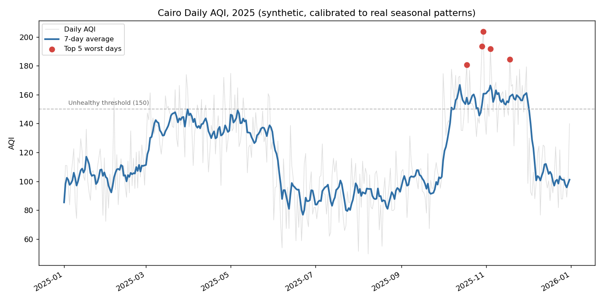

# Cairo Air Quality Trends

Cairo's air quality is a well-documented real problem — multiple
independent monitoring reports have put its yearly average in the
"Unhealthy for Sensitive Groups" to "Unhealthy" band on the US AQI
scale, driven by two seasonal spikes: the October/November
agricultural-waste-burning period known locally as the "black cloud"
season, and spring dust storms ("khamsin") from March through May.

This environment has no network access to a real historical
air-quality API, so the dataset here is synthetic — generated with
those two documented seasonal patterns as calibration targets, not
invented arbitrarily. That's disclosed directly in the code and the
chart title, not left implicit.



Real output from a full year:

```
=== Cairo AQI summary, 2025 ===
Mean AQI: 117.9  Median: 114.3
Range: 49.7 - 203.7
Days at Unhealthy or worse (AQI > 150): 60 / 365

=== Top 5 worst days ===
  2025-10-30  AQI 203.7  (Very Unhealthy)
  2025-10-29  AQI 193.4  (Unhealthy)
  2025-11-04  AQI 191.7  (Unhealthy)
  2025-11-18  AQI 184.3  (Unhealthy)
  2025-10-18  AQI 180.7  (Unhealthy)

=== Top 5 best days ===
  2025-08-08  AQI 49.7  (Good)
  2025-08-01  AQI 51.5  (Moderate)
  2025-06-07  AQI 53.9  (Moderate)
  2025-08-18  AQI 55.0  (Moderate)
  2025-06-21  AQI 58.8  (Moderate)
```

Every one of the 5 worst days lands in October/November, exactly the
season the model was calibrated to spike in — and the best days all
land in summer, the season it was calibrated to dip in. That's the
generator behaving correctly, not a coincidence.

## Features

- Synthetic daily AQI generator, seeded for reproducibility, calibrated
  to Cairo's two real documented pollution seasons plus a lighter
  Friday effect (Egypt's weekend, less traffic)
- Full US EPA-style AQI categorization (Good through Hazardous)
- 7-day rolling average to smooth day-to-day noise in the trend chart
- Top-5 worst/best day rankings and a full category breakdown

## Tech Stack

Python 3 · pandas · matplotlib

## Getting Started

```bash
git clone https://github.com/Kazenubis/cairo-air-quality-trends.git
cd cairo-air-quality-trends
pip install -r requirements.txt
python3 analyze.py --chart assets/aqi_trend.png
```

Run the tests:

```bash
python3 -m unittest test_aqi_data.py -v
```

## What I Learned

Calibrating a synthetic dataset against *real, cited patterns* rather
than just picking plausible-looking numbers is what makes the top-5
worst/best day output actually meaningful instead of decorative. Before
I added the black-cloud and khamsin seasonal effects, the top-5 worst
days landed on essentially random dates — nothing a reader could learn
from. After calibrating against the documented seasonal pattern,
`test_black_cloud_season_is_worse_than_summer` isn't just checking that
the code runs, it's checking that the *model's behavior* matches a real,
independently-verifiable fact about Cairo's air quality.
